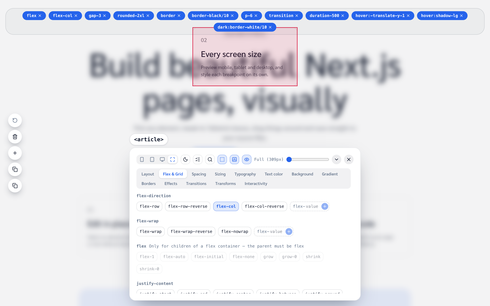
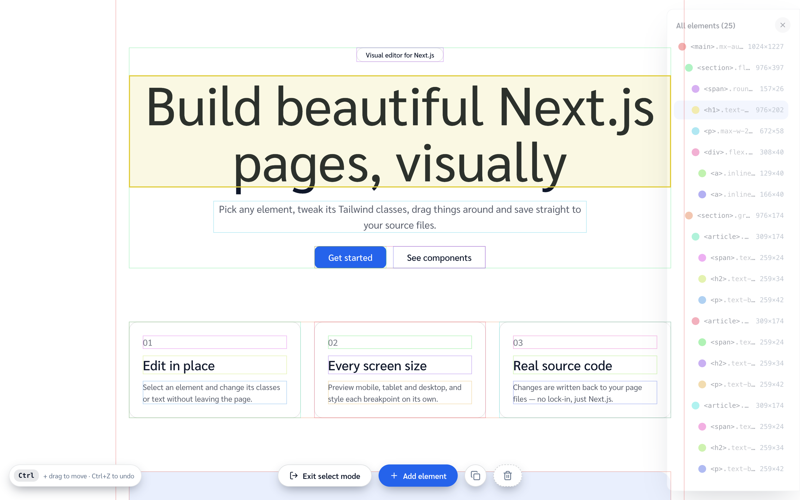
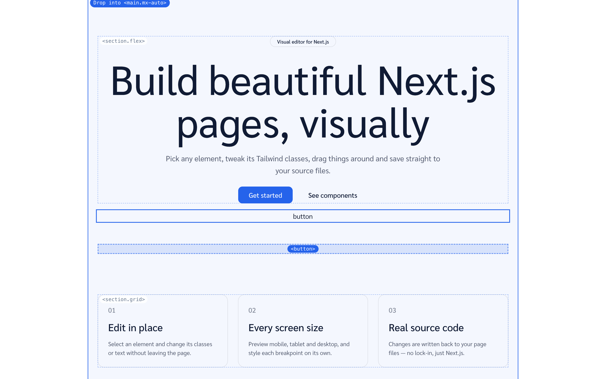
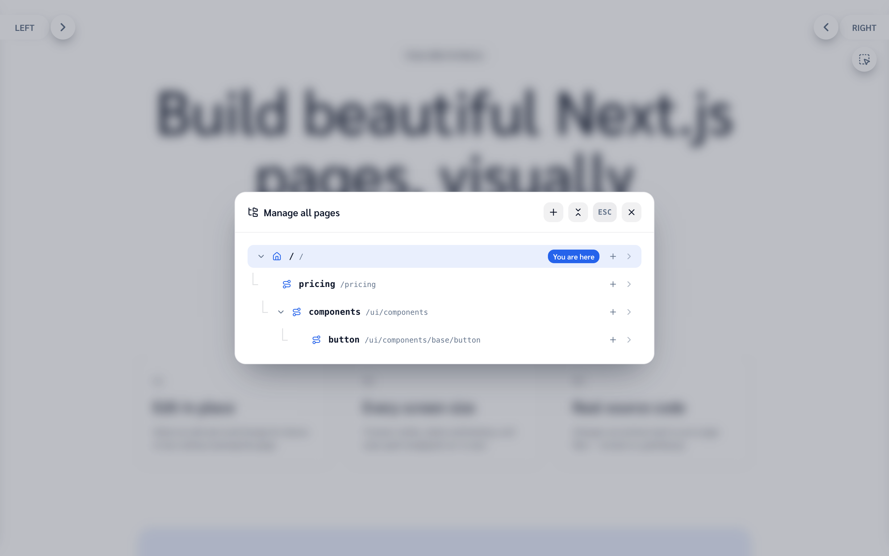
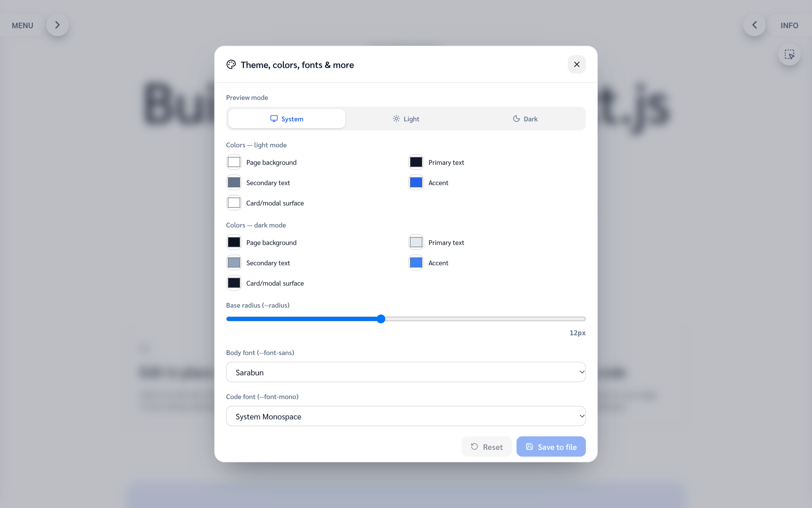

# Srcflow

A visual editor for Next.js that writes real source code.

Click any element on your page, change its Tailwind classes, edit its text, drag it
somewhere else or drop in new elements — Srcflow writes each change straight back into
your `page.tsx`. There is no export step and no lock-in: what you get is an ordinary
Next.js + Tailwind project you can keep editing by hand.



> **Development only.** The editor rewrites files on disk, so it only runs under
> `next dev`. Every editor API route refuses to run in production (`assertDev`), and a
> production build ships just your pages.

## Quick start

Requires Node.js 20.9 or later.

```bash
git clone https://github.com/MeewPunk/srcflow.git
cd srcflow
yarn install
yarn dev
```

Open [http://localhost:3000](http://localhost:3000). The editor wraps the page: a drawer
on each side and a **Select element** button.

## What you can do

### Edit elements in place

Enter select mode (the **Select element** button, or <kbd>Ctrl</kbd> + double-click), then:



- **Click** an element to lock onto it, **double-click** to open the edit panel.
- **Classes** — browse Tailwind classes by category or search (<kbd>F</kbd>). Hovering a
  class previews it live; classes that can't affect the element (e.g. `gap` on a non-flex
  box) are flagged.
- **Breakpoints and dark mode** — pick a device width or dark mode and new classes get the
  right prefix (`md:`, `dark:`…).
- **Text** — plain-text elements are edited directly on the page.
- **Structure** — add elements and components from the palette, drag to move
  (<kbd>Ctrl</kbd> + drag), copy / paste, reorder, delete, undo. The page reflows live
  while you drag, so you see the real result before dropping.
- **Copy as code** — copy an element and paste its JSX, exactly as written in the file.



Class and text edits are saved per element; structural edits are saved together from the
bar at the bottom of the screen.

### Manage the site

- **Route Manager** — create, rename, duplicate and delete pages; add Next.js special files
  (`layout`, `loading`, `error`, `not-found`…); edit page metadata.
- **Theme Manager** — colors (light and dark), fonts and corner radius, written to the CSS
  variables in `src/app/globals.css`.
- **Layout** — classes on `<html>` / `<body>` and site-wide title and description per language.
- **Page checks** — missing `alt`, heading order, links without a locale; click an issue to
  jump to the element.
- **Components** — a small component library (`src/app/ui/components`) you can restyle from
  its own page and drop into any page.

<table>
  <tr>
    <td></td>
    <td></td>
  </tr>
</table>

The editor UI is available in English and Thai. Pages are localized under
`src/app/[lang]` (`en`, `th`).

## How it works

Srcflow edits your source with the TypeScript compiler API, never with string templates
over the whole file:

1. When select mode opens, each element inside `<main>` gets its index in document order.
   The server numbers the JSX elements of the page file the same way, so an index points at
   one exact JSX node.
2. A class or text edit is written to that node only after checking it still holds the
   value the edit started from — if the file changed underneath, nothing is written.
3. A structure save rebuilds the edited part of the tree from those indexes, reusing the
   original source for everything that didn't change, then formats the file.

### Limitations

- Element numbering assumes the rendered DOM matches the JSX order. Pages that build
  elements with `.map()`, conditionals or state can't be edited structurally — the
  inspector is disabled on the component pages for that reason.
- Text is editable in place only when an element contains plain text (or a single
  dictionary lookup).
- Edits to an element you just added or pasted are kept in the page and written to the
  file with the next structure save.

## Keyboard shortcuts

| Keys | Action |
|---|---|
| <kbd>Ctrl</kbd> + double-click | Enter select mode |
| Click / double-click | Lock element / open the edit panel |
| <kbd>↑</kbd> <kbd>↓</kbd> | Go to the outer / inner element |
| <kbd>Ctrl</kbd> + drag | Move element |
| <kbd>Ctrl</kbd> <kbd>C</kbd> / <kbd>Ctrl</kbd> <kbd>V</kbd> | Copy / paste element |
| <kbd>Ctrl</kbd> <kbd>B</kbd> / <kbd>Ctrl</kbd> <kbd>Shift</kbd> <kbd>V</kbd> | Copy / paste className |
| <kbd>Ctrl</kbd> <kbd>↑</kbd> / <kbd>↓</kbd> | Reorder |
| <kbd>Ctrl</kbd> <kbd>Delete</kbd> | Delete element |
| <kbd>F</kbd> | Search classes (edit panel) |
| <kbd>Ctrl</kbd> <kbd>Z</kbd> | Undo |
| <kbd>Esc</kbd> | Cancel / exit |

On macOS, <kbd>Ctrl</kbd> is <kbd>⌘</kbd>.

## Project structure

```
src/
├─ app/
│  ├─ [lang]/            your pages (one folder per route) + dictionaries
│  ├─ api/               editor endpoints (development only)
│  ├─ ui/components/     component library
│  └─ globals.css        theme variables and type scale
├─ components/editor/    the editor UI
├─ i18n/                 locales and editor translations
└─ lib/                  source rewriting (elementFs, structureFs, routeFs, themeFs…)
```

## Scripts

```bash
yarn dev     # start the editor
yarn build   # production build (editor endpoints disabled)
yarn start   # serve the production build
yarn lint    # ESLint
```

## Built with

Next.js 16 (App Router) · React 19 · Tailwind CSS v4 · TypeScript · lucide-react

## Contributing

Issues and pull requests are welcome — see [CONTRIBUTING.md](CONTRIBUTING.md) and the
design rules in [DESIGN.md](DESIGN.md).

## License

[MIT](LICENSE)
